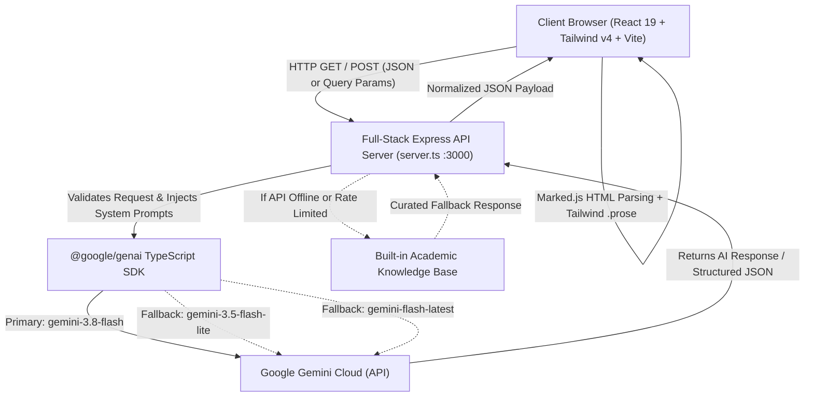
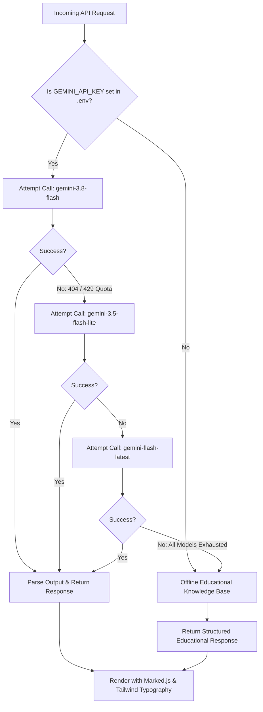
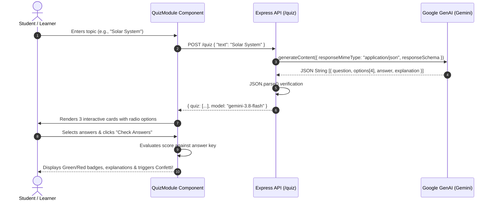
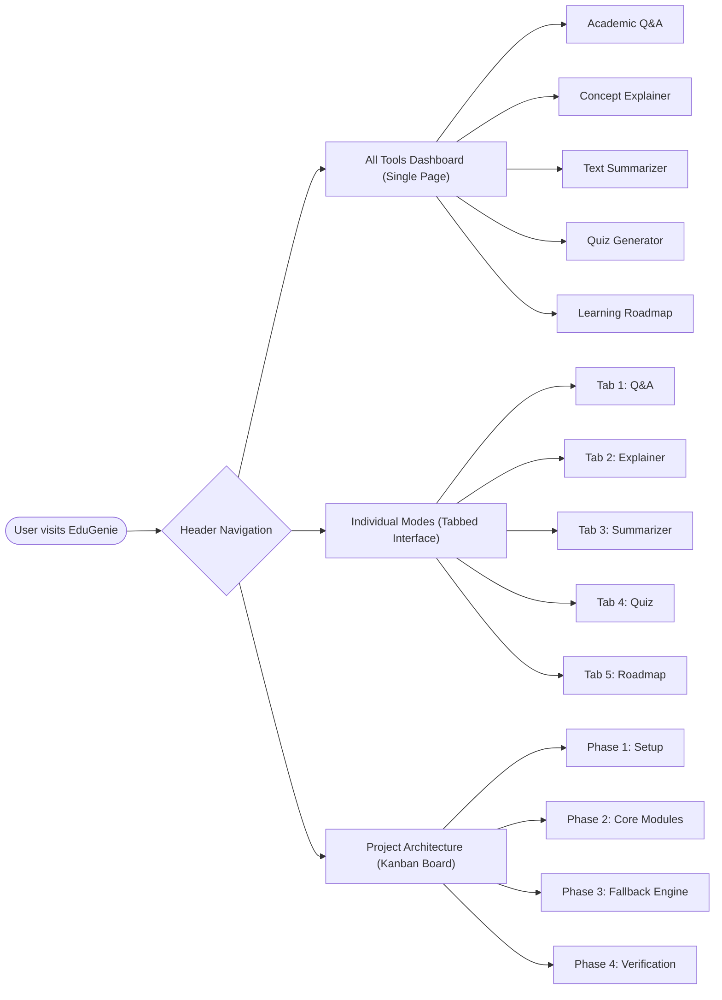

# EduGenie 🎓 &mdash; Intelligent Academic Learning Assistant

<div align="center">


[](https://www.typescriptlang.org/)
[](https://react.dev/)
[](https://tailwindcss.com/)
[](https://expressjs.com/)
[](https://ai.google.dev/)
[](https://vitejs.dev/)

<p align="center">
  <strong>Fast, accessible study support powered by Google Gemini reasoning models.</strong><br>
  Instant Q&A &bull; Concept Explanations &bull; Revision Summaries &bull; Interactive MCQ Quizzes &bull; Adaptive Roadmaps
</p>

[Quick Start](#-quick-start--setup-guide) &bull;
[API Key Guide](#-where--how-to-obtain-your-gemini-api-key) &bull;
[System Architecture](#-system-architecture--flowcharts) &bull;
[Webflow & User Journey](#-application-webflow) &bull;
[API Reference](#-api-endpoints-specification) &bull;
[Tech Stack](#-complete-technology-stack)

</div>

---

## 📑 Table of Contents

- [Overview & Value Proposition](#-overview--value-proposition)
- [Key Features](#-key-features)
- [System Architecture & Flowcharts](#-system-architecture--flowcharts)
  - [1. High-Level System Architecture](#1-high-level-system-architecture)
  - [2. Multi-Model Cascade & Fallback Flowchart](#2-multi-model-cascade--fallback-flowchart)
  - [3. Quiz Generation & Validation Engine](#3-quiz-generation--validation-engine)
- [Application Webflow & User Journey](#-application-webflow)
  - [Visual User Flowchart](#visual-user-flowchart)
  - [State & Navigation Lifecycle](#state--navigation-lifecycle)
- [Complete Technology Stack](#-complete-technology-stack)
- [Quick Start & Setup Guide](#-quick-start--setup-guide)
  - [Prerequisites](#prerequisites)
  - [Step 1: Clone the Repository](#step-1-clone-the-repository)
  - [Step 2: Install Dependencies](#step-2-install-dependencies)
  - [Step 3: Setup Environment Variables (.env)](#step-3-setup-environment-variables-env)
  - [Step 4: Launch Development Server](#step-4-launch-development-server)
  - [Step 5: Production Build](#step-5-production-build)
- [Where & How to Obtain Your Gemini API Key](#-where--how-to-obtain-your-gemini-api-key)
- [API Endpoints Specification](#-api-endpoints-specification)
  - [Endpoint 1: Q&A (`/qa`)](#endpoint-1-qa-qa)
  - [Endpoint 2: Concept Explainer (`/explain`)](#endpoint-2-concept-explainer-explain)
  - [Endpoint 3: Summarizer (`/summarize`)](#endpoint-3-summarizer-summarize)
  - [Endpoint 4: Quiz Generator (`/quiz`)](#endpoint-4-quiz-generator-quiz)
  - [Endpoint 5: Learning Recommendations (`/learn/recommendations`)](#endpoint-5-learning-recommendations-learnrecommendations)
  - [Health & Status Check (`/api/status`)](#health--status-check-apistatus)
- [Directory & File Structure](#-directory--file-structure)
- [Testing & CLI Verification](#-testing--cli-verification)
- [Production Deployment](#-production-deployment)
- [Contributing & License](#-contributing--license)

---

## 💡 Overview & Value Proposition

**EduGenie** is an intelligent academic companion engineered to bridge the gap between complex academic material and student comprehension. Rather than giving raw, unformatted LLM outputs, EduGenie enforces:

1. **Student-Centric Prompting**: Uses analogies, real-world examples, and beginner-friendly scaffolding.
2. **Clean Typography**: Strict Markdown rendering with Tailwind typography (`.prose`), eliminating asterisks, raw markdown artifacts, and misalignment.
3. **Structured Learning Tools**: Produces interactive, self-grading quizzes and phased roadmaps with zero setup friction.
4. **Reliability & Resilience**: Features a **Multi-Model Cascade** (`gemini-3.8-flash` &rarr; `gemini-3.5-flash-lite` &rarr; `gemini-flash-latest`) alongside a built-in offline educational fallback knowledge base.

---

## ✨ Key Features

| Feature | Endpoint | Description |
| :--- | :--- | :--- |
| **Instant Academic Q&A** | `/qa` | Answers academic, historical, and scientific questions with structured bullet points and clean copy buttons. |
| **Concept Explainer** | `/explain` | Breaks down intricate topics (e.g., *XGBoost*, *Quantum Superposition*, *Photosynthesis*) using analogies and key takeaways. |
| **Text Summarizer** | `/summarize` | Distills textbook chapters, research papers, and lecture transcripts into high-yield revision summaries. |
| **Interactive Quiz Engine** | `/quiz` | Dynamically creates 3 MCQs with 4 options, instant visual scoring (green/red feedback), answer explanations, and confetti animations. |
| **Adaptive Roadmap Advisor** | `/learn/recommendations` | Builds 3-phase Zero-to-Hero roadmaps (Beginner &rarr; Intermediate &rarr; Advanced) with timeframes and resource recommendations. |
| **Interactive Project Kanban** | View 3 (`/docs`) | Built-in project tracker and architecture inspector detailing milestone progress and API specifications. |

---

## 🏛 System Architecture & Flowcharts

### 1. High-Level System Architecture



---

### 2. Multi-Model Cascade & Fallback Flowchart

EduGenie prevents downtime by gracefully shifting between Gemini model tiers and deterministic offline responses:



---

### 3. Quiz Generation & Validation Engine

EduGenie uses strict **JSON Schema Enforcement** so that AI-generated quizzes are always valid, parseable, and ready for interactive client rendering:



---

## 🗺 Application Webflow

### Visual User Flowchart



### State & Navigation Lifecycle

1. **Header Navigation**:
   - **All Tools**: Shows all 5 modules simultaneously in an integrated single-page layout (ideal for desktop study sessions).
   - **Individual Modes**: Focused tab-by-tab study workflow (ideal for mobile or focused problem-solving).
   - **Project Architecture**: Interactive Kanban tracking all project requirements, specs, and status.
2. **Scenarios Bar**:
   - Quick 1-click test scenarios directly populate inputs across all modules (e.g., *Largest Ocean*, *Photosynthesis*, *Industrial Revolution*, *Solar System*, *Full Stack Web Development*).
3. **Response Rendering**:
   - Content passes through `marked.parse()` and Tailwind CSS `.prose` classes for beautiful lists, bold terms, headers, and code snippets.
   - Built-in `navigator.clipboard` copy button with temporary "Copied" feedback.

---

## 💻 Complete Technology Stack

```
EduGenie Stack
├── Frontend
│   ├── React 19 (^19.0.1) ─────────── Declarative UI & hooks
│   ├── Tailwind CSS v4 (^4.3.3) ───── Utility styling & typography
│   ├── Marked (^18.0.14) ──────────── Markdown to sanitized HTML
│   ├── Canvas Confetti (^1.9.4) ───── Quiz celebration animations
│   ├── Lucide React (^0.546.0) ────── UI iconography
│   └── Vite (^8.3.0) ──────────────── Next-gen build & bundling
├── Backend
│   ├── Node.js (v18+ / v20+) ──────── Runtime environment
│   ├── Express.js (^4.21.2) ───────── HTTP REST server & middlewares
│   ├── tsx (^4.21.0) ──────────────── Native TypeScript execution
│   └── Archiver (^7.0.1) ──────────── Project export & zipping
└── AI & Intelligence
    ├── @google/genai (^2.4.0) ─────── Official Google GenAI SDK
    ├── gemini-3.8-flash ───────────── Primary reasoning model
    ├── gemini-3.5-flash-lite ──────── High-speed fallback model
    └── gemini-flash-latest ────────── Secondary fallback model
```

---

## 🚀 Quick Start & Setup Guide

### Prerequisites
- **Node.js**: v18.0.0 or higher ([Download Node.js](https://nodejs.org/))
- **npm**: v9.0.0 or higher (comes with Node.js)
- A **Google Gemini API Key** ([Free from Google AI Studio](https://aistudio.google.com/))

---

### Step 1: Clone the Repository
```bash
git clone https://github.com/your-username/edugenie.git
cd edugenie
```

---

### Step 2: Install Dependencies
Install all required frontend and backend packages:
```bash
npm install
```

---

### Step 3: Setup Environment Variables (`.env`)

Copy the provided example file to create your active `.env`:

```bash
# On Linux / macOS:
cp .env.example .env

# On Windows (Command Prompt):
copy .env.example .env

# On Windows (PowerShell):
Copy-Item .env.example .env
```

Open the newly created `.env` file in your code editor:

```env
# ===================================================
# EduGenie Environment Configuration
# ===================================================

# Add your Google Gemini API key below:
GEMINI_API_KEY="YOUR_GEMINI_API_KEY_HERE"

# Local Server Port (default: 3000)
PORT=3000
```

> 🔒 **Security Notice**: Never commit `.env` to GitHub. The `.gitignore` file is already preconfigured to exclude `.env`.

---

### Step 4: Launch Development Server
Start the full-stack development server with live reload:
```bash
npm run dev
```

Open your browser and navigate to:
```
http://localhost:3000
```

---

### Step 5: Production Build
To test the optimized production build locally:
```bash
# 1. Compile TypeScript and bundle frontend with Vite
npm run build

# 2. Run the production Express server
npm start
```

---

## 🔑 Where & How to Obtain Your Gemini API Key

Follow these simple steps to obtain your free Gemini API key:

1. **Visit Google AI Studio**: Navigate to [https://aistudio.google.com/](https://aistudio.google.com/).
2. **Sign In**: Log in using your Google Account.
3. **Get API Key**: In the top navigation or left sidebar, click the blue **"Get API key"** button.
4. **Create Key**: Click **"Create API key in new project"** (or select an existing Google Cloud project).
5. **Copy Key**: Copy the secret token (it usually starts with `AIzaSy...`).
6. **Paste into `.env`**:
   ```env
   GEMINI_API_KEY="AIzaSyYourGeneratedSecretKeyHere"
   ```
7. **Restart the Server**:
   ```bash
   npm run dev
   ```

*Note: EduGenie is designed to work even if you do not have an API key right away. If the key is omitted, the app will smoothly serve structured academic knowledge-base fallbacks without crashing!*

---

## 🔌 API Endpoints Specification

EduGenie supports both **GET** (with URL query parameters) and **POST** (with JSON body) across all study routes:

### Endpoint 1: Q&A (`/qa`)
- **URL**: `/qa` or `/api/qa`
- **Method**: `GET | POST`
- **Request (POST)**:
  ```json
  {
    "question": "Which is the largest ocean on Earth?"
  }
  ```
- **Response**:
  ```json
  {
    "answer": "The largest ocean on Earth is the **Pacific Ocean**!\n\nHere are key facts:\n* **Massive Size:** Covers >60M sq miles (>30% of Earth's surface).\n* **Record Depth:** Home to Mariana Trench (Challenger Deep at 36,000 ft).\n* **Name Origin:** Named 'Pacífico' in 1520 by Ferdinand Magellan.",
    "model": "gemini-3.8-flash"
  }
  ```

---

### Endpoint 2: Concept Explainer (`/explain`)
- **URL**: `/explain` or `/api/explain`
- **Method**: `GET | POST`
- **Request (POST)**:
  ```json
  {
    "topic": "XGBoost Machine Learning"
  }
  ```
- **Response**:
  ```json
  {
    "topic": "XGBoost Machine Learning",
    "explanation": "Imagine building a LEGO tower with friends...\n\n### The Analogy\nInstead of one person guessing, a team corrects each other's mistakes in stages...\n\n### Key Takeaways\n- **Boosting:** Combining simple decision trees sequentially.\n- **Error Correction:** Each tree fixes earlier mistakes.\n- **Speed:** Highly optimized for modern CPUs.",
    "model": "gemini-3.5-flash-lite"
  }
  ```

---

### Endpoint 3: Summarizer (`/summarize`)
- **URL**: `/summarize` or `/api/summarize`
- **Method**: `GET | POST`
- **Request (POST)**:
  ```json
  {
    "text": "The Industrial Revolution was the transition to new manufacturing processes in Great Britain, continental Europe, and the United States from around 1760 to 1840."
  }
  ```
- **Response**:
  ```json
  {
    "summary": "**Industrial Revolution: Key Points**\n\n- **Definition:** Transition from agrarian handicraft to machine-driven manufacturing.\n- **Timeline:** ~1760 to 1840.\n- **Origin:** Great Britain, subsequently spreading globally.",
    "model": "gemini-3.8-flash"
  }
  ```

---

### Endpoint 4: Quiz Generator (`/quiz`)
- **URL**: `/quiz` or `/api/quiz`
- **Method**: `GET | POST`
- **Request (POST)**:
  ```json
  {
    "text": "Photosynthesis"
  }
  ```
- **Response**:
  ```json
  {
    "quiz": [
      {
        "question": "Which pigment absorbs sunlight during photosynthesis?",
        "options": ["Hemoglobin", "Chlorophyll", "Melanin", "Carotene"],
        "answer": "Chlorophyll",
        "explanation": "Chlorophyll is the green pigment in plant leaves that traps light energy."
      },
      {
        "question": "What gas do plants release as a byproduct?",
        "options": ["Carbon Dioxide", "Nitrogen", "Oxygen", "Methane"],
        "answer": "Oxygen",
        "explanation": "During light reactions, water is split and oxygen is released."
      },
      {
        "question": "What primary sugar is synthesized as food for the plant?",
        "options": ["Glucose", "Lactose", "Fructose", "Sucrose"],
        "answer": "Glucose",
        "explanation": "Plants store solar energy in the chemical bonds of glucose."
      }
    ],
    "model": "gemini-3.8-flash"
  }
  ```

---

### Endpoint 5: Learning Recommendations (`/learn/recommendations`)
- **URL**: `/learn/recommendations` or `/api/learn/recommendations`
- **Method**: `GET | POST`
- **Request (POST)**:
  ```json
  {
    "topic": "Full Stack Web Development"
  }
  ```
- **Response**:
  ```json
  {
    "topic": "Full Stack Web Development",
    "recommendation": "## Learning Path for Full Stack Web Development\n\n### Stage I: Beginner (Foundations - 2 to 3 weeks)\n- HTML5 semantic structure & CSS responsive layouts\n- JavaScript ES6+ fundamentals\n\n### Stage II: Intermediate (Applications - 4 to 6 weeks)\n- React & TypeScript component architectures\n- Node.js & Express RESTful APIs\n\n### Stage III: Advanced (Mastery - 6+ weeks)\n- Database modeling, caching & production deployments",
    "model": "gemini-3.8-flash"
  }
  ```

---

### Health & Status Check (`/api/status`)
- **URL**: `/api/status`
- **Method**: `GET`
- **Response**:
  ```json
  {
    "status": "ok",
    "hasApiKey": true,
    "defaultModel": "gemini-3.8-flash",
    "fallbackModel": "gemini-3.5-flash-lite",
    "version": "1.0.0",
    "appName": "EduGenie"
  }
  ```

---

## 📂 Directory & File Structure

```text
edugenie/
├── .env                        # Active environment variables (git-ignored)
├── .env.example                # Example environment template
├── .gitignore                  # Git ignore rules
├── index.html                  # HTML5 entry template
├── metadata.json               # Project capabilities & permissions manifest
├── package.json                # Dependencies, scripts & engine config
├── README.md                   # Comprehensive project documentation
├── server.ts                   # Express full-stack server & Gemini cascades
├── tsconfig.json               # TypeScript configuration
├── tsconfig.node.json          # Node TypeScript configuration
├── vite.config.ts              # Vite bundler & plugin configuration
│
└── src/                        # React Frontend Source Code
    ├── App.tsx                 # Root application component & layout state
    ├── index.css               # Global Tailwind CSS & .prose typography
    ├── main.tsx                # Client DOM bootstrap
    ├── types.ts                # Shared TypeScript models & interfaces
    │
    └── components/             # Modular Feature Components
        ├── ApiKeyModal.tsx     # Status & key configuration inspector
        ├── ExplainModule.tsx   # Concept Explainer with student analogies
        ├── Header.tsx          # Clean header with navigation
        ├── LearningPathModule.tsx # 3-stage adaptive roadmap advisor
        ├── ProjectShowcase.tsx # System architecture & Kanban board
        ├── QAModule.tsx        # Academic Q&A with Markdown rendering
        ├── QuizModule.tsx      # MCQ quiz generator with live scoring & confetti
        ├── ScenariosBar.tsx    # 1-click test scenarios bar
        └── SummarizeModule.tsx # Revision summarizer component
```

---

## 🧪 Testing & CLI Verification

You can test the backend directly from your terminal using `curl`:

```bash
# 1. Verify API status
curl -s http://localhost:3000/api/status

# 2. Test Q&A with GET query
curl -s "http://localhost:3000/qa?question=What%20causes%20the%20tides"

# 3. Test Concept Explainer with POST JSON
curl -s -X POST http://localhost:3000/explain \
  -H "Content-Type: application/json" \
  -d '{"topic":"Quantum Computing"}'

# 4. Test Quiz Generator
curl -s -X POST http://localhost:3000/quiz \
  -H "Content-Type: application/json" \
  -d '{"text":"Pythagorean Theorem"}'
```

---

## 🌐 Production Deployment

### Option A: Google Cloud Run / Container Platforms
1. Ensure `PORT=3000` and `GEMINI_API_KEY` are provided in environment secrets.
2. Build command: `npm run build`
3. Start command: `npm start`

### Option B: Render / Railway
1. Connect your GitHub repository.
2. Set Environment to **Node**.
3. Build Command: `npm install && npm run build`
4. Start Command: `npm start`
5. Add `GEMINI_API_KEY` in the environment settings tab.

---

## 📜 License & Attribution

This project is open-source and released under the **MIT License**. Built with ❤️ for students and educators worldwide.
